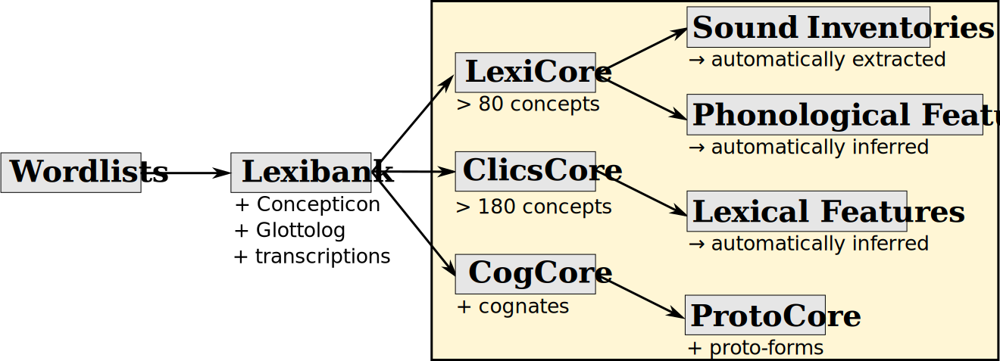

# Lexibank Analysed

## How to cite

If you use these data please cite
- the original source
  > List, Johann-Mattis; Forkel, Robert; Greenhill, Simon J.; Rzymski, Christoph; Englisch, Johannes; and Russell D. Gray (2021): Lexibank: A publicly available repository of standardized lexical datasets with automatically computed phonological and lexical features for more than 2000 language varieties [Dataset, Version 1.0]. Geneva: Zenodo.
- the derived dataset using the DOI of the [particular released version](../../releases/) you were using

## Description

This dataset is licensed under a CC-BY-4.0 license

Available online at https://lexibank.clld.org

## Notes

### Core Sets

The core-sets are defined by using the following criteria:

## Statistics

- **Varieties:** 2,671 (linked to 2,671 different Glottocodes)
- **Concepts:** 3,178 (linked to 3,178 different Concepticon concept sets)
- **Lexemes:** 1,094,877
- **Sources:** 102
- **Synonymy:** 1.12
- **Invalid lexemes:** 0
- **Tokens:** 6,244,189
- **Segments:** 1,855 (0 BIPA errors, 0 CLTS sound class errors, 1846 CLTS modified)
- **Inventory size (avg):** 38.76

## Possible Improvements:

- Languages linked to [bookkeeping languoids in Glottolog](http://glottolog.org/glottolog/glottologinformation#bookkeepinglanguoids):
  - Taungtha (Wethet) [rung1263](http://glottolog.org/resource/languoid/id/rung1263)
  - Thaiphum (Rengkheng) [thai1262](http://glottolog.org/resource/languoid/id/thai1262)
  - Doitu (Hetsawlay) [song1313](http://glottolog.org/resource/languoid/id/song1313)
  - Laitu (Khuasung) [lait1239](http://glottolog.org/resource/languoid/id/lait1239)
  - Laisaw Thu Htay Kung [lait1239](http://glottolog.org/resource/languoid/id/lait1239)
  - Songlai-Hettui 8Karchaung (Hettui) [song1313](http://glottolog.org/resource/languoid/id/song1313)
  - Songlai-Maung Um (Song) 1Maung Um (Song) [song1313](http://glottolog.org/resource/languoid/id/song1313)
  - Laitu Ahongdong [lait1239](http://glottolog.org/resource/languoid/id/lait1239)

# Contributors

Name               | GitHub user | Description | Role
---                | ---         | --- | ---
Johann-Mattis List | @LinguList  | maintainer | Author
Robert Forkel | @xrotwang | maintainer | Author
Simon J. Greenhill | @simongreenhill | maintainer | Author
Christoph Rzymski | @chrzyki | maintainer | Author
Johannes Englisch | @johenglisch | maintainer | Author
Russell D. Gray | | maintainer | Author

## CLDF Datasets

The following CLDF datasets are available in [cldf](cldf):

- CLDF [Wordlist](https://github.com/cldf/cldf/tree/master/modules/Wordlist) at [cldf/wordlist-metadata.json](cldf/wordlist-metadata.json)
- CLDF [StructureDataset](https://github.com/cldf/cldf/tree/master/modules/StructureDataset) at [cldf/phonology-metadata.json](cldf/phonology-metadata.json)
- CLDF [StructureDataset](https://github.com/cldf/cldf/tree/master/modules/StructureDataset) at [cldf/lexicon-metadata.json](cldf/lexicon-metadata.json)
- CLDF [StructureDataset](https://github.com/cldf/cldf/tree/master/modules/StructureDataset) at [cldf/phonemes-metadata.json](cldf/phonemes-metadata.json)