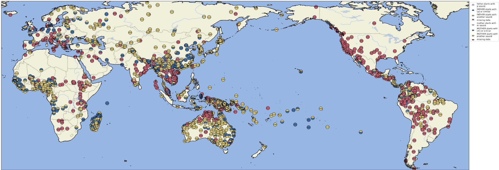

# Plotting Instructions

In the following, we illustrate how the plots in the major study can be created with the help of the [cldfviz](https://github.com/cldf/cldfviz) package. The package offers plots in two major formats: *static* in the form of a PDF that requires additional packages like [cartopy](https://scitools.org.uk/cartopy/) and [matplotlib](https://maplotlib.org), and *interactive* in the form of an HTML file which you can open and inspect in the major webbrowsers. For the study, we have created the plots in the form of a PDF first and later post-edited the arrangements of the legends manually. As a result, the plots shown here do not correspond entirely to the ones you will find in the study. 

Note that the installation of cartopy can cause troubles due to incompatible versions. As a result, we ask you to refer to the interactive HTML plots instead of the PDF plots if you do not manage to install cartopy properly.

To assemble the data, you will also need the [csvkit](https://pypi.org/project/csvkit/) package.

## Preliminaries


## Statistics

We will use `csvcut` and other shell tools to explore the statistics of our data collection. Thus, in order to count the number of languages in the Lexibank collection of Lexibank, we just type:

```shell
$ csvcut cldf/languages.csv -c ID | sort -u | wc -l
3666
```

To count unique Glottocodes, we type:

```shell
$ csvcut cldf/languages.csv -c Glottocode | sort -u | wc -l
2087
```

To count the number of languages in our LexiCore and our ClicsCore collection, we type:

```shell
$ csvcut cldf/languages.csv -c ID,Incollections | grep "LexiCore" | sort -u | wc -l
2916
$ csvcut cldf/languages.csv -c ID,Incollections | grep "ClicsCore" | csvcut -c ID | sort -u | wc -l
1784
```

And to count the number of distinct languages by Glottocode, we type:

```shell
$ csvcut cldf/languages.csv -c Glottocode,Incollections | grep "LexiCore" | sed s/ClicsCore// | sort -u | wc -l
2067
$ csvcut cldf/languages.csv -c Glottocode,Incollections | grep "ClicsCore" | sed s/LexiCore// | sort -u | wc -l
1246
```

This yields all in all the following Table X:

Subset | Languages | Varieties | Words 
--- | --- | --- | ---
LexiCore | 2067 | 2916 | 
ClicsCore | 1246 | 1784 |
 


## Distribution of the Data in Lexibank

In order to plot the data shown in Figure 1 of the main study, open a terminal inside the lexibank-analysed package and type the following command:

```shell
$ cldfbench cldfviz.map cldf/phonology-metadata.json --language-properties-colormaps tol,tol,tol --language-properties=Forms,Concepts,Incollections --format pdf --pacific-centered --width=40 --height=20 --dpi=300 --markersize=100
```

For the interactive version of the data in HTML format, type:

```shell
$ cldfbench cldfviz.map cldf/phonology-metadata.json --language-properties-colormaps tol,tol,tol --language-properties=Forms,Concepts,Incollections --format html --pacific-centered --width=40 --height=20 --dpi=300 --markersize=100
```

This yields the Figure 2 in the dataset.


## Sound-Symbolic Features in the LexiCore Subset of Lexibank

In order to plot Figure 4 in our draft, use the following command:

```shell
cldfbench cldfviz.map cldf/phonology-metadata.json --colormaps tol,tol --format pdf --pacific-centered --markersize=100 --parameters=FatherWithP,MotherWithM --width=40 --height=20 --include-missing --dpi=300
```

For the interactive output, you can type:

```shell
$ cldfbench cldfviz.map cldf/phonology-metadata.json --colormaps tol,tol --format html --pacific-centered --markersize=10 --parameters=FatherWithP,MotherWithM --include-missing
```


This yields the Figure 4 in the dataset.




