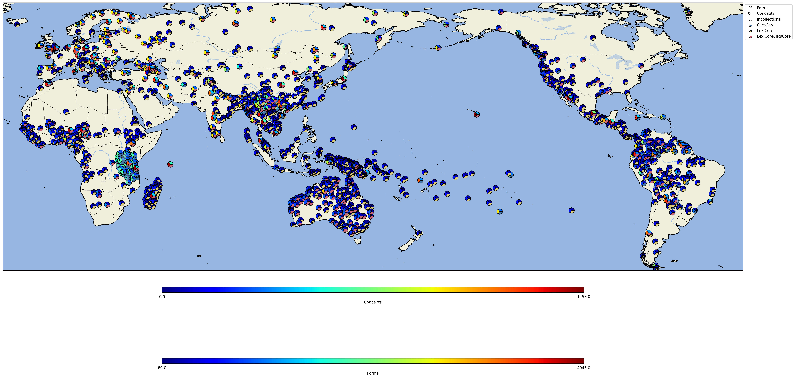
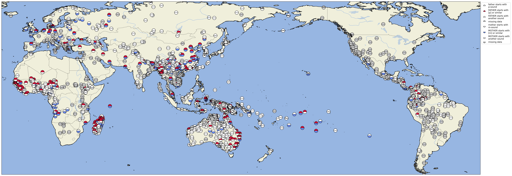
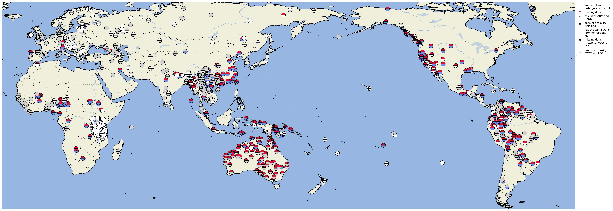
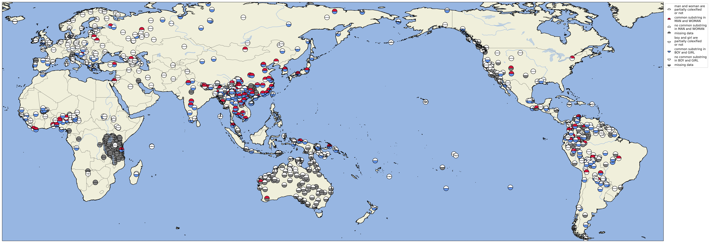
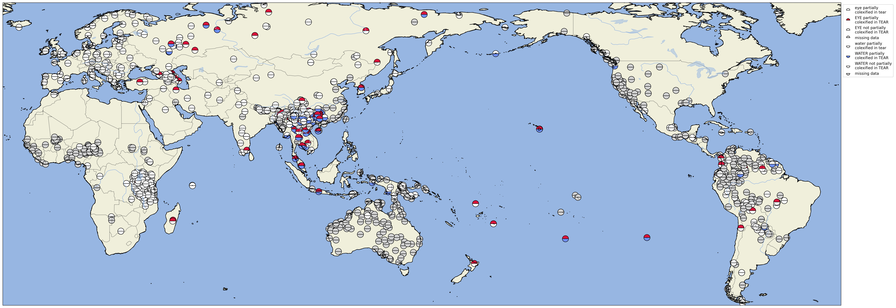

# Plotting Instructions

In the following, we illustrate how the plots in the major study can be created with the help of the [cldfviz](https://github.com/cldf/cldfviz) package. The package offers plots in two major formats: *static* in the form of a PDF that requires additional packages like [cartopy](https://scitools.org.uk/cartopy/) and [matplotlib](https://maplotlib.org), and *interactive* in the form of an HTML file which you can open and inspect in the major webbrowsers. For the study, we have created the plots in the form of a PDF first and later post-edited the arrangements of the legends manually. As a result, the plots shown here do not correspond entirely to the ones you will find in the study. 

Note that the installation of cartopy can cause troubles due to incompatible versions. As a result, we ask you to refer to the interactive HTML plots instead of the PDF plots if you do not manage to install cartopy properly.

To assemble the data, you will also need the [csvkit](https://pypi.org/project/csvkit/) package.

## Statistics

We can use `csvcut` and other shell tools to explore the statistics of our data collection. Thus, in order to count the number of languages in the Lexibank collection of Lexibank, we just type:

```shell
csvcut cldf/languages.csv -c ID | sort -u | wc -l
4070
```

To count unique Glottocodes, we type:

```shell
csvcut cldf/languages.csv -c Glottocode | sort -u | wc -l
2457
```

To count the number of languages in our LexiCore and our ClicsCore collection, we type:

```shell
csvcut cldf/languages.csv -c ID,Incollections | grep "LexiCore" | sort -u | wc -l
3320
csvcut cldf/languages.csv -c ID,Incollections | grep "ClicsCore" | csvcut -c ID | sort -u | wc -l
1784
```

And to count the number of distinct languages by Glottocode, we type:

```shell
csvcut cldf/languages.csv -c Glottocode,Incollections | grep "LexiCore" | sed s/ClicsCore// | sort -u | wc -l
2208
csvcut cldf/languages.csv -c ID,Incollections | grep "ClicsCore" | sort -u | wc -l
1806
```

The summary statistics are also given in the file `cldf/collections.csv` and `cldf/contributions.csv`. Re-computing them here is merely for testing the consistency.

## Distribution of the Data in Lexibank

In order to plot the data shown in Figure 1 of the main study, open a terminal inside the lexibank-analysed package and type the following command:

```shell
cldfbench cldfviz.map cldf/phonology-metadata.json --language-properties-colormaps=jet,jet,tol --language-properties=Forms,Concepts,Incollections --format=jpg --pacific-centered --width=40 --height=20 --dpi=300 --markersize=100 --output=plots/figure-2
```

For the interactive version of the data in HTML format, type:

```shell
cldfbench cldfviz.map cldf/phonology-metadata.json --language-properties-colormaps jet,jet,tol --language-properties=Forms,Concepts,Incollections --format=html --pacific-centered --markersize=100 --output=plots/figure-2
```

This yields the Figure 2 in the dataset.



## Sound-Symbolic Features in the LexiCore Subset of Lexibank

In order to plot Figure 4 in our draft, use the following command:

```shell
cldfbench cldfviz.map cldf/phonology-metadata.json --colormaps '{"True":"#DC143C","False":"#FFFFFF"},{"True": "#6495ED", "False": "#FFFFFF"}' --missing-value "#808080" --format=jpg --pacific-centered --markersize=100 --parameters=FatherWithP,MotherWithM --width=40 --height=20 --dpi=300 --output=plots/figure-4
```

For the interactive output, you can type:

```shell
cldfbench cldfviz.map cldf/phonology-metadata.json --colormaps '{"True":"#DC143C","False":"#FFFFFF"},{"True": "#6495ED", "False": "#FFFFFF"}' --format html --pacific-centered --markersize=10 --parameters=FatherWithP,MotherWithM --missing-value "#808080" --output=plots/figure-4
```


This yields the Figure 4 in the dataset.




## Lexical Features

In order to plot Figure 5 in our draft, use the following command:

```shell
cldfbench cldfviz.map cldf/lexicon-metadata.json --colormaps '{"True":"#DC143C","False":"#FFFFFF"},{"True": "#6495ED", "False": "#FFFFFF"}' --missing-value "#808080" --format=jpg --pacific-centered --markersize=100 --parameters=ArmAndHand,LegAndFoot --width=40 --height=20 --dpi=300 --output=plots/figure-5
```

For the interactive output, you can type:

```shell
cldfbench cldfviz.map cldf/lexicon-metadata.json --colormaps '{"True":"#DC143C","False":"#FFFFFF"},{"True": "#6495ED", "False": "#FFFFFF"}' --missing-value "#808080" --format=html --pacific-centered --markersize=100 --parameters=ArmAndHand,LegAndFoot --output=plots/figure-5
```

This yields the Figure 5 in the dataset.



In order to plot Figure 5 in our draft, use the following command:

```shell
cldfbench cldfviz.map cldf/lexicon-metadata.json --colormaps '{"True":"#DC143C","False":"#FFFFFF"},{"True": "#6495ED", "False": "#FFFFFF"}' --missing-value "#808080" --format=jpg --pacific-centered --markersize=100 --parameters=CommonSubstringInManAndWoman,CommonSubstringInBoyAndGirl --width=40 --height=20 --dpi=300 --output=plots/figure-6
```

For the interactive output, you can type:

```shell
cldfbench cldfviz.map cldf/lexicon-metadata.json --colormaps '{"True":"#DC143C","False":"#FFFFFF"},{"True": "#6495ED", "False": "#FFFFFF"}' --missing-value "#808080" --format=html --pacific-centered --markersize=100 --parameters=CommonSubstringInManAndWoman,CommonSubstringInBoyAndGirl --output=plots/figure-6
```

This yields the Figure 5 in the dataset.




In order to plot Figure 7 in our draft, use the following command:

```shell
cldfbench cldfviz.map cldf/lexicon-metadata.json --colormaps '{"True":"#DC143C","False":"#FFFFFF"},{"True": "#6495ED", "False": "#FFFFFF"}' --missing-value "#808080" --format=jpg --pacific-centered --markersize=100 --parameters=EyeInTear,WaterInTear --width=40 --height=20 --dpi=300 --output=plots/figure-7
```

For the interactive output, you can type:

```shell
cldfbench cldfviz.map cldf/lexicon-metadata.json --colormaps '{"True":"#DC143C","False":"#FFFFFF"},{"True": "#6495ED", "False": "#FFFFFF"}' --missing-value "#808080" --format=html --pacific-centered --markersize=100 --parameters=EyeInTear,WaterInTear --output=plots/figure-7
```

This yields the Figure 7 in the dataset.


