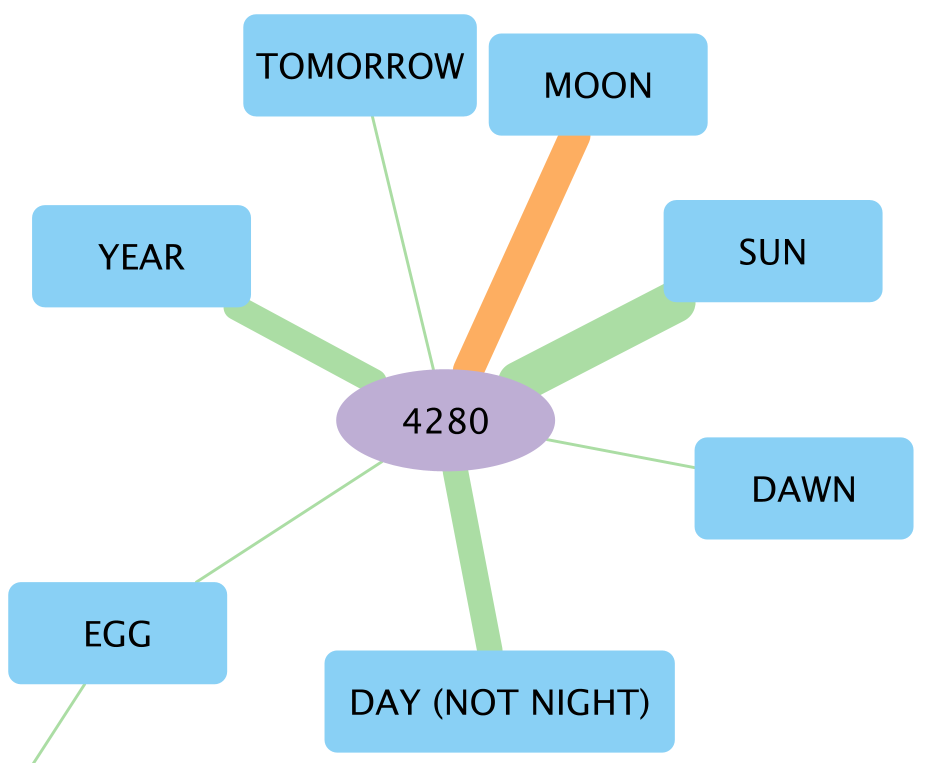

# Accessing the Lexibank data via SQLite queries

## Install dependencies

In a first step, we install all the necessary requirements for running the code presented here.

```shell
cd analysis/
pip install -r requirements.txt
```

Then, we convert the Lexibank data to a SQLite database that we can query:

```shell
cldf createdb ../cldf/wordlist-metadata.json lexibank.sqlite3
```

## Query one Wordlist Against Lexibank

The queries discussed in this chapter are stored in the folder `soundclass_queries`.

```shell
cd queries
```

The first set of queries that we will present are based on Dolgopolsky sound classes. They are run via the script `match_soundclasses.py`, and look for matches in sound classes for data from a specific language, compared to all other languages in Lexibank. Two queries are offered: `base.sql`, and `extended.sql`. Both are called via the command line, where you can also specify the glottocode from the language that you want to compare with all other cases. The `base.sql` query only gives you the number of matches, while `extended.sql` also provides you with the list of matches themselves. In both cases, the results are stored in `matches.tsv` and a map is created as `index.html` that you can open in a browser. Here, the languages with most matches are colored accordingly.

```shell
python match_soundclasses.py --query=q_base.sql --glottocode=kusu1250
```

```shell
python match_soundclasses.py --query=q_extended.sql --glottocode=cand1248
```

The third query uses the `q_proto.sql` query. Here, we check for matches based on a list of lexical forms provided in `data.txt`. This replaces the glottocode, since we provide the data manually.

```shell
python match_soundclasses.py --query=q_proto.sql
```

```md
Name                        ID                                   Glottocode    Family               Latitude    Longitude    Hits
--------------------------  -----------------------------------  ------------  -----------------  ----------  -----------  ------
Dumagat, Casiguran          abvdphilippines-417                  casi1235      Austronesian            16.22       121.88       8
Kalabra                     berrywestpapuan-Kalabra              kala1256      West Bird's Head        -1.43       131.62       8
Kilokaka                    tryonsolomon-kilokaka                zaza1245      Austronesian            -8.19       159.25       8
Kokota                      tryonsolomon-kokota                  koko1269      Austronesian            -8.16       159.19       7
Poro                        tryonsolomon-poro                    gaoo1237      Austronesian            -8.35       159.79       7
Pukapuka                    abvdoceanic-Pukapuka_152             puka1242      Austronesian           -10.91      -165.83       7
Thai                        wold-Thai                            thai1261      Tai-Kadai               16.00       101.00       7
Tibetan (Written)           marrisonnaga-WrittenTibetan          clas1254      Sino-Tibetan            30.03        91.16       7
Akhvakh (Northern dialect)  idssegmented-akhvakhnortherndialect  akhv1239      Nakh-Daghestanian       42.40        46.30       6
Anuta                       tryonsolomon-anuta                   anut1237      Austronesian           -11.61       169.85       6
```

## Queries: Colexifications

The next query shows how you can easily extract specific colexifications between Concepticon concepts. You simply add the two concepts to the function call that you want to compare, and receive a full list of language varieties that feature the colexification in question. The resulting map provides you with information on geographic spread of the languages involved as well as their lexical forms.

```shell
python colexifications.py --concept_1 'SUN' --concept_2 'MOON'
```

## Queries: Semantic diversity of cognate set

The last query is a bit different, since it makes use of a specific Lexibank dataset, `blumpanotacana`. The same query can be run with all datasets of the *CogCore* subset, since all it requires are annotations for cognacy.

For preparing the data, we only need to clone the repository and create the SQLite database.

```shell
cd cognateset_diversity
git clone https://github.com/pano-takanan-history/blumpanotacana 
cldf createdb blumpanotacana/cldf/cldf-metadata.json blumpanotacana.sqlite3
python cognateset_diversity.py
```

The script provides an output of the different concepts that are annotated for cognacy, as well as the amount of languages in each subgroup that features such semantic value. The result can be visualized by a colexification network.

{width=50%}

In the example we can see that cognateset *4280* features a range of different semantics, where all Tacanan languages have the meaning of MOON, while the Panoan languages feature YEAR, SUN, DAY, and others.
