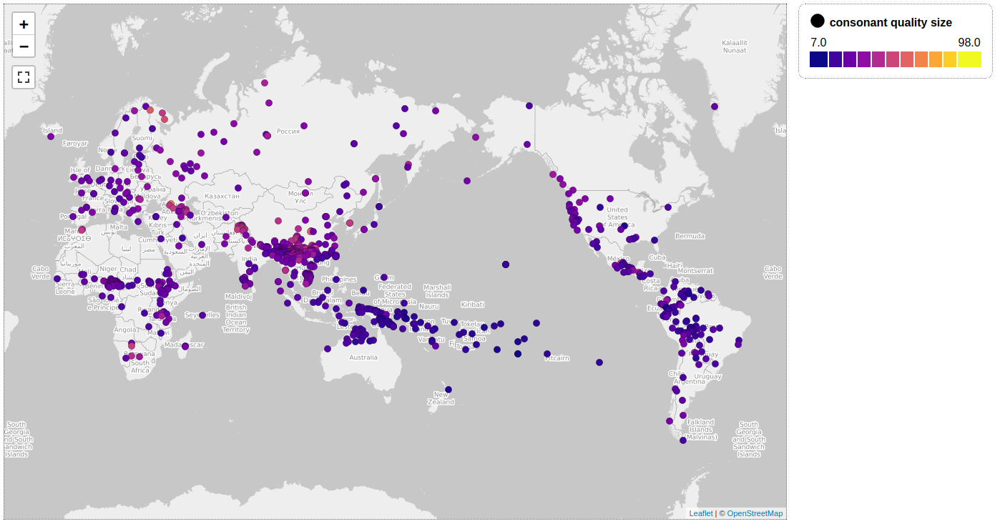
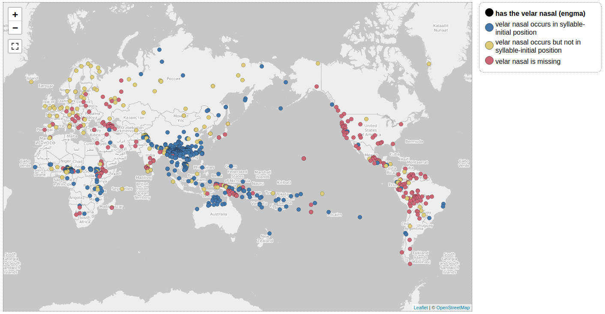
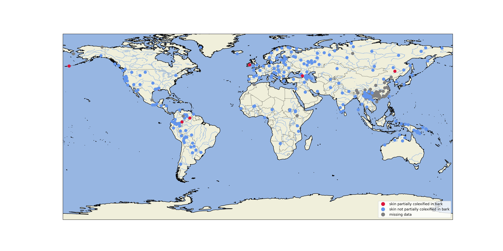
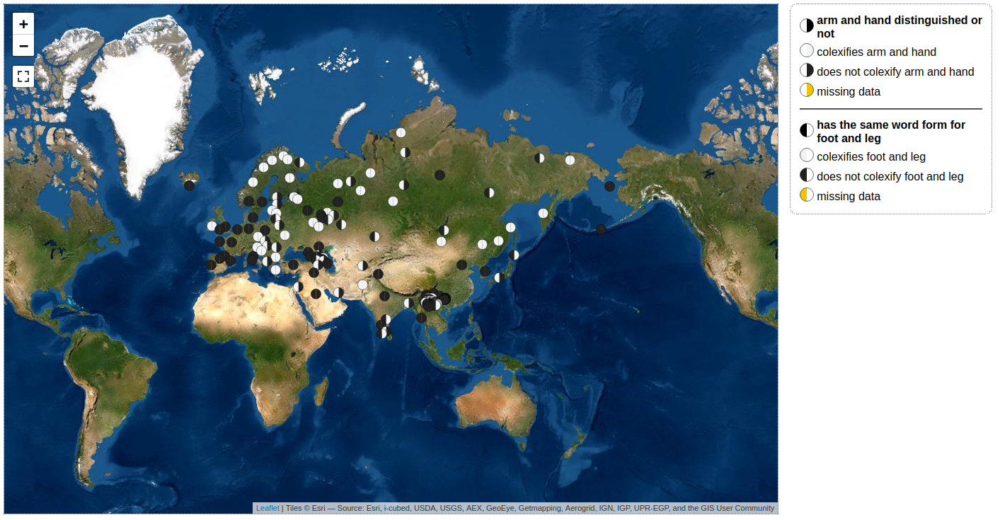

# Using the Lexibank Data Repository

Lexibank is a collection of lexical datasets provided in [CLDF](https://cldf.clld.org) formats. These CLDF datasets were compiled with the help of the `pylexibank` package, which is an extension for the [CLDFBench](https://github.com/cldf/cldfbench) package for handling CLDF datasets. Since data in the lexibank collection is maximally integrated with cross-linguistic resources that have been compiled during the past years, it is possible to make active use of the data to compute many features (lexical and phonological) automatically. In the following, we will describe the major workflow.

## 1 Lexibank Collection

The lexibank collection consists of mainly two types of datasets:

1. CLDF datasets linked to Concepticon and Glottolog with consistent lexeme forms which have a sufficient size in terms of concepts covered. This collection is called `clicscore` collection, since it fulfills the criteria to be included into the [CLICS](https://clics.clld.org) database. The collection can be used to compute various lexical features for individual language varieties.
2. CLDF datasets linked to Concepticon and Glottolog with lexeme forms which are transcribed in the BIPA transcription system proposed by the [CLTS](https://clts.clld.org) project. This collection, which may overlap with the `clicscore` collection, is called `lexicore` and can be used to compute various phonological features for language varieties.

The decision about which datasets are assigned to which collection is currently carried out by the board of lexibank editors, who estimate how well each of the datasets qualifies for the inclusion in either or both collections. The decisions are available in the form of a spreadsheet, shared along with this repository (see [src/lexibank/data/lexibank.tsv](https://github.com/lexibank/lexibank-study/blob/main/src/lexibank/data/lexibank.tsv)).

The original datafile itself will be curated on the [nextcloud server of the MPI-EVA](https://share.eva.mpg.de/index.php/s/dqmqQn567P4PKie). For now, however, we experience problems with the nextcloud server and therefore edit the spreadsheet on [GoogleSheets](https://docs.google.com/spreadsheets/d/1x8c_fuWkUYpDKedn2mNkKFxpwtHCFAOBUeRT8Mihy3M/edit?usp=sharing). 


## 2 Lexibank Workflow

This repository contains a `cldfbench` package, bundling

- code
  - to download the lexibank dataset,
  - to compute phonological and lexical features from this data and
- The computed structural data in three CLDF StructureDatasets.

The workflow consists of a sequence of calls to `cldfbench` subcommands,
which in turn call the code described above.


1. Install the package (including Dependencies)
   ```shell
   $ git clone https://github.com/lexibank/lexibank-analysed
   $ cd lexibank-analysed
   $ pip install -e .
   ```

2. Download the data collections

   The data collections will be downloaded by reading the most recent selection of 
   lexibank datasets from the file `src/lexibank/data/lexibank.tsv` and then downloading the relevant datasets to a folder which you specify with the kewyord `destination`. We will call the folder `datasets` in the following.

   ```shell
   $ cldfbench download cldfbench_lexibank_analysed.py
   ```

3. Compute phonological and lexical features and phoneme inventories

   The analysis results of `lexibank-analysed` are stored in three CLDF StructureDatasets.

   - Phonological features (inspired by those features typically listed in datasets like the 
     [World Atlast of Language Structures](https://wals.info) are computed with the help of the phonological feature inference methods provided by the [cltoolkits](https://github.com/cldf/cltoolkit) package, which offers facilitated (high-level) access to CLDF datasets (specifically lexical datasets). Having downloaded the data packages, you can run the following code to compute the current 18 phonological features from the `lexicore` data. Since the target of phonological features is `lexicore` data (data defined in the `lexicore` collection of lexibank), the command will create a file called `lexicore.json`, in which the major information on phonological features is stored.
   - Lexical features (dedicated colexifications and partial colexifications) are computed as well.
   - Phoneme inventories including frequencies are derived.

   These datasets are created running
   ```shell
   $ cldfbench makecldf cldfbench_lexibank_analysed.py 
   ```

4. Make sure valid CLDF data has been created:
   ```shell
   pytest
   ```


## 3 Data exploration

To check for available features, you can inspect the CLDF ParameterTable of the respective
CLDF datasets:
```shell
$ csvcut -c ID,Name cldf/phonology-features.csv | column -n -s"," -t
ID                         Name
concepts                   Number of concepts
forms                      Number of forms
bipa_forms                 Number of BIPA conforming forms
senses                     Number of senses
ConsonantQualitySize       consonant quality size
VowelQualitySize           vowel quality size
VowelSize                  vowel size
ConsonantSize              consonant size
CVRatio                    consonant and vowel ratio
CVQualityRatio             consonant and vowel ratio (by quality)
CVSoundRatio               consonant and vowel ratio (including diphthongs and clusters)
HasNasalVowels             has nasal vowels or not
HasRoundedVowels           has rounded vowels or not
VelarNasal                 has the velar nasal (engma)
PlosiveVoicingGaps         voicing and gaps in plosives
LacksCommonConsonants      gaps in plosives
HasUncommonConsonants      has uncommon consonants
PlosiveFricativeVoicing    voicing in plosives and fricatives
UvularConsonants           presence of uvular consonants
GlottalizedConsonants      presence of glottalized consonants
HasLaterals                presence of lateral consonants
SyllableStructure          complexity of the syllable structure
FirstPersonWithM           fist person starts with an m-sound
FirstPersonWithN           fist person starts with an n-sound
SecondPersonWithT          second person starts with a t-sound
SecondPersonWithM          second person starts with an m-sound
SecondPersonWithN          second person starts with an n-sound
MotherWithM                mother starts with m-sound
WindWithF                  wind starts with f-sound
HasPrenasalizedConsonants  inventory has pre-nasalized consonants
HasLabiodentalFricatives   inventory has labio-dental fricatives or affricates
FatherWithP                father starts with p-sound
SyllableOnset              complexity of the syllable onset
SyllableOffset             complexity of the syllable offset
```

```shell
$ csvcut -c ID,Name cldf/lexicon-features.csv | column -n -s"," -t
ID                                Name
concepts                          Number of concepts
forms                             Number of forms
senses                            Number of senses
LegAndFoot                        has the same word form for foot and leg
ArmAndHand                        arm and hand distinguished or not
BarkAndSkin                       bark and skin distinguished or not
FingerAndHand                     finger andhand distinguished or not
GreenAndBlue                      green and blue colexified or not
RedAndYellow                      red and yellow colexified or not
ToeAndFoot                        toe and foot colexified or not
SeeAndKnow                        see and know colexified or not
SeeAndUnderstand                  see and understand colexified or not
ElbowAndKnee                      elbow and knee colexified or not
FearAndSurprise                   fear and surprise colexified or not
CommonSubstringInElbowAndKnee     elbow and knee are partially colexified or not
CommonSubstringInManAndWoman      man and woman are partially colexified or not
CommonSubstringInFearAndSurprise  fear and surprise are partially colexified or not
CommonSubstringInBoyAndGirl       boy and girl are partially colexified or not
EyeInTear                         eye partially colexified in tear
BowInElbow                        bow partially colexified in elbow
CornerInElbow                     corner partially colexified in elbow
WaterInTear                       water partially colexified in tear
TreeInBark                        tree partially colexified in bark
SkinInBark                        skin partially colexified in bark
MouthInLip                        mouth partially colexified in lip
SkinInLip                         skin partially colexified in lip
HandInFinger                      hand partially colexified in finger
FootInToe                         foot partially colexified in toe
ThreeInEight                      three partially colexified in eight
ThreeInThirteen                   three partially colexified in thirteen
FingerAndToe                      finger and toe colexified or not
HairAndFeather                    hair and feather colexified or not
HearAndSmell                      hear and smell colexified or not
```

You can also easily inspect the data for outliers:
```shell
$ csvgrep -c Parameter_ID -m ConsonantQualitySize cldf/phonology-values.csv | csvstat -c Value
  4. "Value"

	Type of data:          Number
	Contains null values:  False
	Unique values:         55
	Smallest value:        7
	Largest value:         98
	Sum:                   24.148
	Mean:                  27,072
	Median:                26
	StDev:                 10,078
	Most common values:    27 (53x)
	                       23 (38x)
	                       29 (38x)
	                       24 (37x)
	                       22 (36x)

Row count: 892

$ csvgrep -c Parameter_ID -m ConsonantQualitySize cldf/phonology-values.csv | csvgrep -c Value -r"^7|98$" | csvcut -c Language_ID,Value
Language_ID,Value
chenhmongmien-NortheastYunnanChuanqiandian,98
johanssonsoundsymbolic-Rotokas,7
```


## 4 Data visualization

Visual exploration of the data can be done with `cldfviz`, a `cldfbench` plugin to visualize
CLDF datasets.

We can plot continuous variables on a map, e.g. `ConsonnantQualitySize`:
```shell
cldfbench cldfviz.map cldf/phonology-metadata.json --parameters ConsonantQualitySize --colormaps plasma --pacific-centered
```
A screenshot of the resulting [leaflet map](https://leafletjs.com/) is shown below. (To plot printable
maps, install `cldfviz` with `cartopy` support and choose a different output format using the
`--format` option.)



Map plots for categorical variables like `VelarNasal` are supported as well.
This feature is equivalent to [feature 9A from WALS](https://wals.info/feature/9A).

We can inspect the values:
```shell
$ csvgrep -c Parameter_ID -m "VelarNasal" cldf/phonology-codes.csv | csvcut -c ID,Name | column -s, -t -n
ID            Name
VelarNasal-1  velar nasal occurs in syllable-initial position
VelarNasal-2  velar nasal occurs but not in syllable-initial position
VelarNasal-3  velar nasal is missing
```
and plot it on a map:
```shell
cldfbench cldfviz.map cldf/phonology-metadata.json --parameters VelarNasal --colormaps tol --pacific-centered
```




As a final type of feature, consider `SkinInBark`.
This feature is a so-called partial colexification, which means that the word expressing "skin" recurs in part in the 
word expressing "bark" in the language variety in question, while not being identical with it.

This feature has two major values, `true` and `false`, and -- as a third case -- `None`, when data are missing (there 
is no word for "skin" or for "bark" in our data). 
We can plot the feature in the same way in which we plotted the data before

```
cldfbench cldfviz.map cldf/lexicon-metadata.json --parameters SkinInBark --pacific-centered
```




You can also plot two features at the same time onto a map +++ but for now only logical features +++. In order to do so, just select those features which you think are useful to be inspected synchronously, and type:

```
cldfbench cldfviz.map cldf/lexicon-metadata.json --parameters ArmAndHand,LegAndFoot --pacific-centered --base-layer Esri_WorldImagery --markersize 15
```

The resulting plot offers a new account on the data by combining feature information for two features. 


